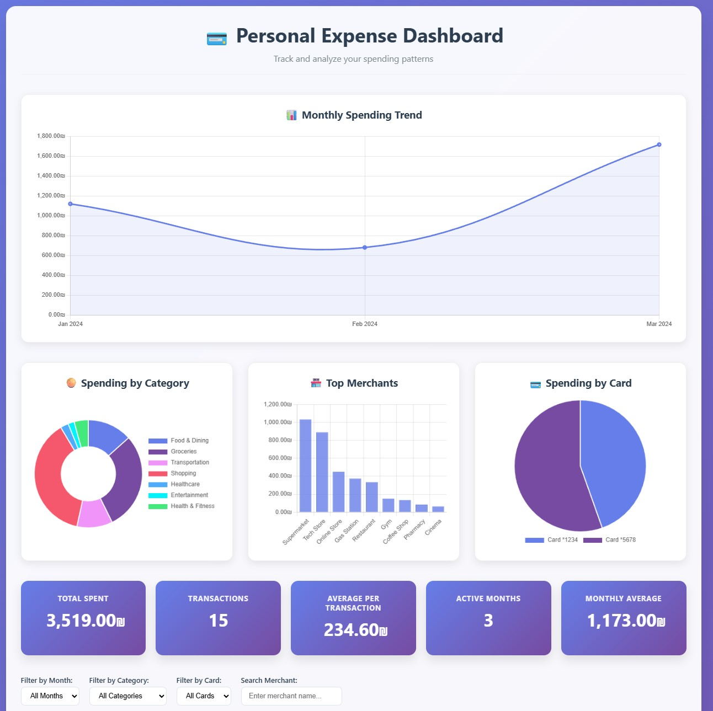

# Personal Expense Dashboard

A beautiful, interactive expense tracking dashboard built with HTML, CSS, and Chart.js Front End, Elasticsearch backend and FastAPI REST API.



## Features

- **Dashboard View**: Interactive charts showing spending by category, merchant, and card
- **Monthly Trends**: Line chart tracking spending over time
- **Filtering**: Filter expenses by month, category, card, or search by merchant
- **Full CRUD Operations**: Create, read, update, and delete expenses
- **Elasticsearch Backend**: Fast, scalable search and storage
- **Kibana Analytics**: Advanced data analysis, visualizations, and dashboards

## Architecture

```
??? backend/                 # FastAPI backend
?   ??? main.py             # API endpoints
?   ??? models.py           # Pydantic models
?   ??? elasticsearch_client.py  # ES connection
?   ??? requirements.txt    # Python dependencies
??? scripts/
?   ??? migrate_data.py     # Data migration script
??? docker-compose.yml      # Elasticsearch + Kibana setup
??? index.html              # Frontend dashboard
??? expense_data.json       # Sample data
```

## Prerequisites

- Python 3.10+
- Docker and Docker Compose

## Quick Start with Docker Compose

The easiest way to get started is using Docker Compose, which sets up both Elasticsearch and Kibana:

```bash
# Start Elasticsearch and Kibana
docker-compose up -d

# Wait for services to be healthy (about 30-60 seconds)
docker-compose ps

# Install Python dependencies
cd backend
python -m venv venv
source venv/bin/activate  # On Windows: venv\Scripts\activate
pip install -r requirements.txt

# Migrate sample data
cd ../scripts
python migrate_data.py

# Start the API server
cd ../backend
uvicorn main:app --reload
```

### Access Points

| Service | URL | Description |
|---------|-----|-------------|
| **Dashboard** | `http://localhost:3000` | Expense dashboard (serve index.html) |
| **API** | `http://localhost:8000` | FastAPI backend |
| **API Docs** | `http://localhost:8000/docs` | Swagger UI |
| **Kibana** | `http://localhost:5601` | Data analysis & visualization |
| **Elasticsearch** | `http://localhost:9200` | Search engine |

## Kibana Setup

Once Kibana is running at `http://localhost:5601`:

### 1. Create a Data View

1. Go to **Stack Management** > **Data Views**
2. Click **Create data view**
3. Set name: `expenses`
4. Set index pattern: `expenses`
5. Click **Save data view to Kibana**

### 2. Explore Your Data

- **Discover**: Browse and search raw expense documents
- **Visualize Library**: Create charts and graphs
- **Dashboard**: Build custom analytics dashboards

### 3. Example Visualizations to Create

| Visualization | Type | Description |
|---------------|------|-------------|
| Monthly Spending | Line Chart | Track spending trends over time |
| Category Breakdown | Pie Chart | See spending distribution by category |
| Top Merchants | Bar Chart | Identify most frequent merchants |
| Card Usage | Donut Chart | Compare spending across cards |
| Spending Heatmap | Heatmap | Visualize spending patterns |

### 4. Sample Kibana Queries

In the **Discover** tab, try these KQL queries:

```
# High-value transactions
amount > 200

# Food-related expenses
category: "Food & Dining" OR category: "Groceries"

# Specific merchant search
merchant: *Coffee*

# Card filter
card: "1234"

# Date range (if using date field)
date >= "01/01/24" AND date <= "31/03/24"
```

## Manual Setup (Without Docker Compose)

### 1. Start Elasticsearch

```bash
docker run -d --name elasticsearch \
  -p 9200:9200 \
  -e "discovery.type=single-node" \
  -e "xpack.security.enabled=false" \
  elasticsearch:8.12.0
```

### 2. Start Kibana (Optional)

```bash
docker run -d --name kibana \
  -p 5601:5601 \
  -e "ELASTICSEARCH_HOSTS=http://host.docker.internal:9200" \
  kibana:8.12.0
```

### 3. Install Python Dependencies

```bash
cd backend
python -m venv venv
source venv/bin/activate
pip install -r requirements.txt
```

### 4. Migrate Sample Data

```bash
cd scripts
python migrate_data.py
```

### 5. Start the Backend

```bash
cd backend
uvicorn main:app --reload
```

### 6. Serve the Dashboard

```bash
python -m http.server 3000
# Open http://localhost:3000
```

## API Endpoints

| Method | Endpoint | Description |
|--------|----------|-------------|
| GET | `/api/expenses` | List all expenses (with filters) |
| GET | `/api/expenses/{id}` | Get single expense |
| POST | `/api/expenses` | Create new expense |
| PUT | `/api/expenses/{id}` | Update expense |
| DELETE | `/api/expenses/{id}` | Delete expense |
| GET | `/api/categories` | List unique categories |
| GET | `/api/months` | List unique months |
| GET | `/api/cards` | List unique card numbers |
| GET | `/health` | Health check |

### Query Parameters for `/api/expenses`

- `month` - Filter by month (e.g., "Jan 2024")
- `category` - Filter by category
- `card` - Filter by card last 4 digits
- `merchant` - Search by merchant name (fuzzy match)
- `min_amount` - Minimum amount filter
- `max_amount` - Maximum amount filter
- `size` - Number of results (default: 1000)

## Environment Variables

| Variable | Default | Description |
|----------|---------|-------------|
| `ELASTICSEARCH_URL` | `http://localhost:9200` | Elasticsearch URL |
| `ELASTICSEARCH_INDEX` | `expenses` | Index name |
| `ELASTICSEARCH_USERNAME` | - | Optional: ES username |
| `ELASTICSEARCH_PASSWORD` | - | Optional: ES password |

## Docker Commands

```bash
# Start services
docker-compose up -d

# View logs
docker-compose logs -f

# Stop services
docker-compose down

# Stop and remove data
docker-compose down -v
```

## License

MIT License - see [LICENSE](LICENSE) for details.
