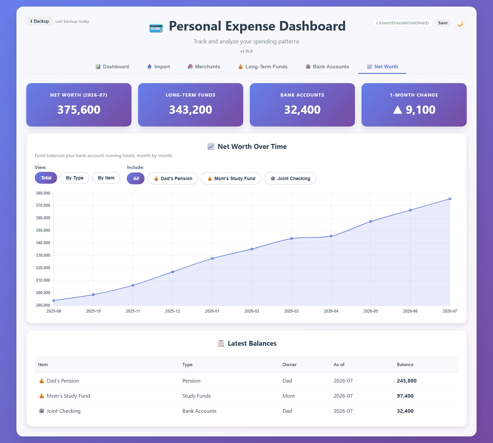

# Personal Expense Dashboard

A local-first household finance dashboard built with Flask, SQLite, and Chart.js. It started as a Bank Leumi credit card statement tracker and has grown into a full household view: credit card spending, bank account cash flow, long-term funds (pension / study fund / investments), and a combined net worth trend.



## 🗂 The Layout

| View | What it does |
|---|---|
| 🏦 **Bank Accounts** | Cash-flow dashboard across all accounts (the app opens here) — import the bank's `.xls` export or enter by hand |
| 💳 **Credit Cards** | Credit card spending: charts, filters, transaction table, and statement import (`.xls`/`.pdf`, with preview & duplicate warnings) |
| 💰 **Long-Term Funds** | Pension / study fund / investment balances, entered monthly, charted over time |
| 🔎 **Look-Through** | Security-level holdings aggregated across all your funds from imported quarterly institutional filings |
| 📈 **Net Worth** | Combined monthly trend of fund balances + bank balances: total, by type, or by item |
| ⚙️ **Manage** (header button) | Categories, credit card merchant→category rules, household members |

Each data type is imported from its own tab — imports live at the bottom of the Credit Cards and Bank Accounts tabs. Management lives behind the ⚙️ button in the header, next to the theme toggle.

## 🎯 Features

- **In-Browser Import**: Drag-and-drop a Bank Leumi `.xls` or `.pdf` statement directly into the dashboard — no command line needed. Preview transactions, see duplicate warnings, and review skipped zero/negative-amount rows before confirming.
- **Automatic Categorization**: Merchants are categorized automatically using saved rules. Any category you assign during import is saved as a rule and applied to that merchant's existing transactions too.
- **Merchant Manager**: View every merchant with its transaction count, change its category, and optionally save the change as a rule for future imports.
- **Category Management**: Add custom categories or delete any category (including built-ins, except "Uncategorized"). Categories live in the database — no separate file to maintain.
- **Visual Analytics**:
  - Monthly spending trend (line chart, year-over-year overlay)
  - Spending by category (horizontal bar chart)
  - Top merchants (bar chart)
  - Spending by card (pie chart)
- **Smart Filtering**: Filter by year (multi-select), month, category, card, status (active/excluded), custom date range, or merchant name search.
- **Transaction Management**:
  - **Inline category editing**: click a transaction's category pill to change it on the spot — updates every transaction for that merchant and saves the rule.
  - **Notes**: add a free-text note to any transaction.
  - **Exclude / restore**: soft-hide a transaction from totals and charts without deleting it.
  - **Permanent delete**: remove a transaction from the database entirely, with a confirmation prompt.
  - **Sortable & resizable columns**: click a column header to sort; drag a column edge to resize — widths are remembered.
- **Summary Cards**: Total spent, transaction count, average per transaction, active months, and monthly average.
- **Household Members**: A simple owner label (e.g. Dad, Mom) you can attach to bank accounts and funds — no logins, it stays a single local tool.
- **Long-Term Funds**: Track pension, study fund (קרן השתלמות), provident fund (קופת גמל), investment provident fund (קופת גמל להשקעה), money market fund (קרן כספית), savings policy (פוליסת חסכון), investment, and real estate balances with one manual entry per month (re-entering the same fund + month updates it). Each fund gets a balance-over-time chart. Funds carry Company Name and Fund Name (both required), an optional Fund Number, a Liquid checkbox for marking cash-equivalent funds, and Management Fees — a fund can carry more than one at once (e.g. a Deposits fee and a separate Total/balance fee), each shown as a removable badge with its basis (Deposits/Earnings/Total) and percentage. The Manage Funds table has Type as its first column, every field editable directly in place (dropdowns and the checkbox save immediately, text fields save when you click away), every column sortable by clicking its header, an ℹ tooltip on every column explaining what it means, a type filter, and a Latest Value column showing each fund's most recent recorded balance. When recording a balance, a cascading Company → Fund Name → Fund # → Track # picker resolves to the specific fund as soon as the choice is unambiguous — pick a company with only one fund and it's selected instantly; the Fund # dropdown only appears when two funds genuinely share a company and name, and a further Track # dropdown appears if Fund # still doesn't narrow it down (e.g. two tracks under the same policy number).
- **Stock Holdings**: A separate panel under Long-Term Funds for stock, ESPP, and RSU holdings. Add a holding once (Symbol, Brokerage Firm, Type, Owner, an optional Cost Basis per unit), then record Quantity + Price per unit at each check-in — Total Value and Net Value are derived automatically, never typed. Net Value applies an approximate 25% capital-gains tax to the gain above Cost Basis only (never the full value), correctly handling stock/ESPP (cost basis = purchase price) and RSU (cost basis = fair market value at vesting) alike. If Cost Basis is left blank, Net Value shows a warning instead of guessing. Counts toward Net Worth using Net Value when known, Total Value as a fallback otherwise. No live price lookup — manual entry only, by design, consistent with every other balance in this app.
- **Look-Through Holdings**: Import the quarterly "מצבת נכסים" regulatory filing that Israeli insurance companies and pension/provident fund managers publish, and see security-level exposure aggregated across every one of your funds combined (pension + study fund + provident fund, etc. all sum together), merged with your direct Stock Holdings by ISIN. Add a Track # and Institution Reg # to a fund (Manage Funds table) so the importer knows which rows in the filing belong to it, then upload the institution's `.xlsx` file — full security-level precision, no minimum-weight cutoff. Four views: All Securities, Overlap (securities held in 2+ funds, with each fund's share of the total), Concentration (sector/country/currency rollups, plus same-issuer exposure summed across instrument types — e.g. a bank's stock and its bonds counted together), and Direct + Indirect (fund-derived exposure merged with your directly-held stocks). Re-uploading the same quarter replaces it cleanly; a new quarter is kept as history alongside the old one.
- **Bank Accounts**: A full cash-flow dashboard across all accounts — summary cards (income, expenses, net), a Monthly Cash Flow chart, expenses by category / top descriptions / by account charts, and rich filters (year and account as multi-select pills — view any combination of accounts together — plus month, income/expense type, category, status, date range, search). The transaction table is sortable and paged, with an Income/Expense type column, inline category editing, notes, exclude/restore, and delete. Amounts are auto-signed (income positive, expenses negative). The monthly credit card bill is meant to be entered here as one lump expense — the per-merchant detail stays in the credit card tab.
- **Bank Account Import**: Upload the bank's account-transactions `.xls` export straight into the selected account — preview first, with an account-number cross-check against the file. Duplicates (same date + reference + amount) are detected and skipped, so overlapping monthly exports are safe to re-import. The bank's running balance is captured per transaction and anchors the Net Worth chart to real balances.
- **Monthly Net Cash Flow (distance from zero)**: A collapsed-by-default chart on the Bank Accounts tab — expand it to see each month's net (income − expenses) as a bar rising above or falling below a zero baseline, on a scale symmetric around zero. Surplus months are teal, deficit months are orange. Follows the same filters as the rest of the dashboard.
- **Net Worth**: The top-level picture — fund balances (carried forward between entries) plus bank account running totals, month by month. Three views (Total / By Type / By Item), a multi-select "Include" filter (grouped into categories — Bank Accounts, then one section per fund type) for which accounts and funds to include, a multi-select Owner filter that narrows everything down to one or more household members' net worth, summary cards, and a latest-balances table. The chart uses a colorblind-safe palette in both themes.
- **Exclude from Net Worth**: Any fund or bank account can be excluded from Net Worth with a persistent ⊘/↺ toggle (Manage Funds table, Manage Bank Accounts pills) — the item disappears from Net Worth's totals, chart, and item picker, but keeps counting normally everywhere else (its own Bank Accounts or Long-Term Funds tab is unaffected). Same idea as excluding a transaction, applied to a whole fund or account.
- **Risk Classification**: Every fund and bank account can be given a self-declared risk level — Not Rated, Capital Guaranteed, Low, Moderate, High, or Very High Risk — with an optional free-text note (e.g. "70% equity per my last statement"). A ℹ tooltip explains each level with real-world examples. The tool never assigns a level itself; you always do, since it has no way to see what a fund actually holds. Edit it any time from the Manage Funds table or the Manage Bank Accounts panel.
- **Backup Facility**: One-click backup download (zipped SQLite snapshot), automatic backup before every import and at least every 30 days, configurable backup folder, and a "last backed up" indicator.
- **Dark/Light Theme**: Toggle in the header; preference is remembered (falls back to your OS preference if you've never chosen one).
- **Hebrew Support**: Full RTL handling for Hebrew merchant names, including reversed text from Bank Leumi PDF exports.

## ⚠️ DISCLAIMER

**This tool is provided for educational and informational purposes only.**

- This dashboard is a visualization tool and does NOT provide financial advice
- I am not a financial advisor, accountant, or tax professional
- All financial data stays on your machine — nothing is transmitted anywhere
- **You are solely responsible for:**
  - The accuracy of your financial data
  - Securing your personal financial information
  - Any financial decisions you make based on this tool
  - Compliance with applicable laws and regulations

**Security & Privacy:**
- Never commit real financial data to public repositories
- This tool does not transmit data to any server — it runs a local Flask server on `localhost` only
- Keep your actual statement files (`.xls`/`.pdf`) and database (`expenses.db`) private and secure
- Use at your own risk

**No Warranty:**
This software is provided "AS IS" without warranty of any kind, express or implied. The author is not liable for any damages or losses resulting from use of this tool.

## 💻 Usage

### Prerequisites
```bash
pip install -r requirements.txt
```

### Running the dashboard

1. Clone this repository
2. Start the local server:
   ```bash
   python app.py
   ```
3. Your browser opens automatically to `http://localhost:5000` (or open it manually if it doesn't)
4. Go to the **Import** tab and drag in a Bank Leumi `.xls` or `.pdf` statement to get started

> **Note**: On first run, the app creates a fresh `expenses.db` SQLite database (git-ignored) seeded with built-in categories. There is no sample data and no manual migration step required — everything starts empty and is populated by importing your own statements.

## 📥 Importing Statements

The recommended way to import is in the dashboard itself — the import section at the bottom of the **Credit Cards** tab (or **Bank Accounts** for account exports): drag and drop your file, review the preview (including any duplicate or skipped-row warnings), and confirm.

If you prefer the command line, the same converters are available directly:

### PDF Converter
```bash
pip install pdfplumber
python tools/pdf_to_json.py "path/to/statement.pdf" -o expenses.json
python tools/pdf_to_json.py "path/to/statement.pdf" --db expenses.db   # write straight to the DB
```

### Excel Converter
Bank Leumi's `.xls` export is actually an HTML file, so no extra dependencies are needed. It also contains all your cards in one file.
```bash
python tools/excel_to_json.py "path/to/export.xls" -o expenses.json
python tools/excel_to_json.py "path/to/export.xls" --usd-rate 3.65 --eur-rate 3.92   # include foreign currency
```

Both converters support:
- **Automatic categorization** using `tools/category_rules.json` (git-ignored, built up from your own usage)
- **Interactive mode** (`-i` flag) to categorize unknown merchants from the terminal
- Skipping zero/negative-amount rows (refunds, waived fees) — shown separately rather than silently dropped

## 🛡️ Security

- **XSS Protection**: All rendered data is sanitized before insertion into the page.
- **SRI Check**: External libraries (Chart.js) are loaded with Subresource Integrity hashes.
- **Local only**: The Flask server only binds to `localhost` — no data leaves your machine.

## 🔒 Privacy & Data Security

The dashboard reads from a local `expenses.db` file, created empty on first run. Everything you see comes from statements you import yourself — there's no setup step that loads sample data into the running app. (`expense_data.json` and `tools/convert_data.py`/`tools/migrate_to_db.py` are kept in the repo for historical reference from earlier versions but aren't part of the current import flow.)

**Files that are git-ignored by default** (never get committed): `expenses.db`, `config.json`, `backups/`, `tools/category_rules.json`, and any raw `.xls`/`.xlsx`/`.pdf` statement files placed in `tools/`.

**NEVER commit or upload your real financial data to GitHub or any public repository.**

## 🛠️ Built With

- [Flask](https://flask.palletsprojects.com/) — local web server
- SQLite (Python standard library `sqlite3`) — data storage
- HTML5 / CSS3 / JavaScript (vanilla, no frontend framework)
- [Chart.js](https://www.chartjs.org/) — data visualization
- [pdfplumber](https://github.com/jsvine/pdfplumber) — PDF statement parsing

## 🧪 Tests

```bash
python -m pytest tests/
```

## 📝 License

MIT License - Feel free to use and modify this dashboard for your personal or commercial projects.

THE SOFTWARE IS PROVIDED "AS IS", WITHOUT WARRANTY OF ANY KIND, EXPRESS OR IMPLIED, INCLUDING BUT NOT LIMITED TO THE WARRANTIES OF MERCHANTABILITY, FITNESS FOR A PARTICULAR PURPOSE AND NONINFRINGEMENT.

## 🤝 Contributing

Feel free to fork this project and submit pull requests with improvements!

---

Not affiliated with any financial institution
